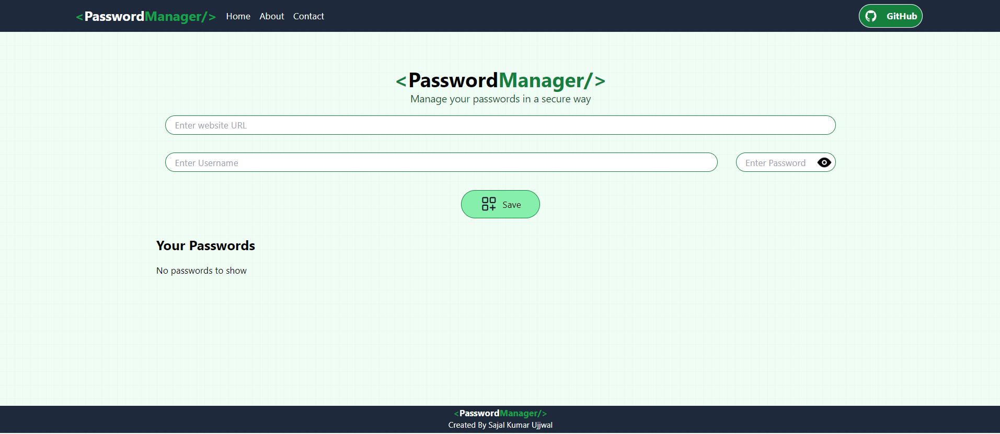
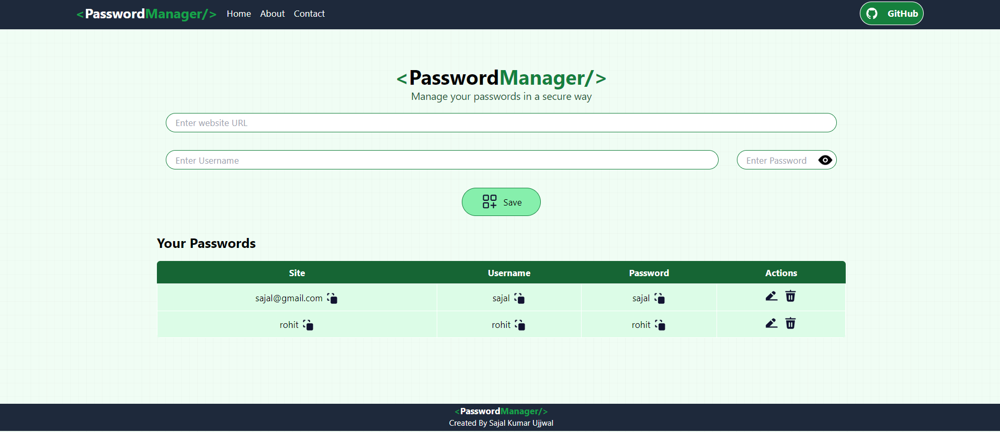
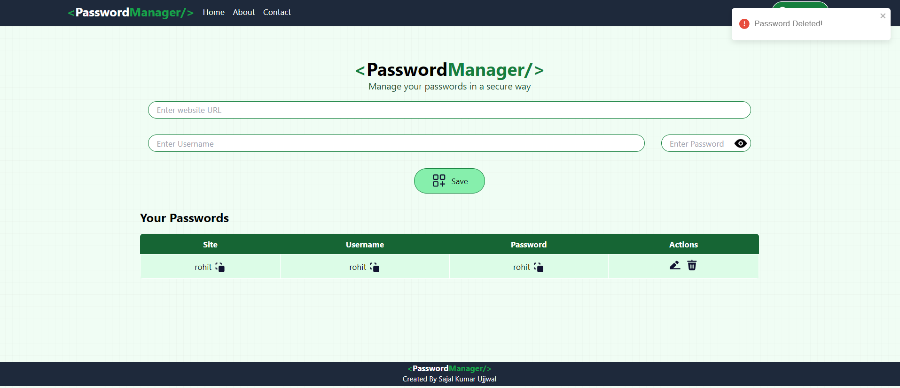

# Password Manager

## Description
A full-featured password manager application built with React and Tailwind CSS. This application allows users to securely store, manage, and edit their passwords with a user-friendly interface and real-time feedback on user actions.

## Features

### 1. Comprehensive Password Management System
- Securely store, manage, and edit passwords.
- Features include saving, editing, deleting, and copying passwords.
- Toggle password visibility for added convenience.

### 2. Customizable and Responsive User Interface
- Designed with Tailwind CSS for a visually appealing and responsive interface.
- Custom styles and dynamic layout adapt to different screen sizes, enhancing user experience.

### 3. State Management and Data Persistence
- Utilized React hooks (`useState`, `useEffect`, `useRef`) for efficient state management.
- Implemented local storage to ensure data persistence across browser sessions, retaining user data even after the application is closed or refreshed.

### 4. User Notifications and Interaction Enhancements
- Integrated `react-toastify` for real-time user notifications.
- Provides feedback on actions such as saving, copying, and deleting passwords.
- Enhanced user interaction with clipboard functionality and dynamic visual elements, including a password visibility toggle and GitHub integration button.

## Getting Started

### Prerequisites
- Node.js
- npm or yarn

### Installation
1. Clone the repository:
   ```bash
   git clone https://github.com/isajalsingh/Password_Manager_LocalStorage-Project.git
   cd Password_Manager_LocalStorage-Project
   ```

2. Install the dependencies:
   ```bash
   npm install
   # or
   yarn install
   ```

### Running the Application
To start the development server, run:
```bash
npm run dev
# or
yarn dev
```
Open [http://localhost:3000](http://localhost:3000) (it may change) to view it in the browser.

## Usage
- **Save Password:** Enter the site URL, username, and password, then click 'Save'.
- **Edit Password:** Click the edit icon next to the password entry you want to edit.
- **Delete Password:** Click the delete icon next to the password entry you want to delete.
- **Copy Password:** Click the copy icon to copy the password to the clipboard.
- **Toggle Password Visibility:** Click the eye icon to toggle the visibility of the password.

## Technologies Used
- React
- Tailwind CSS
- React Toastify
- UUID

## Screenshots




<!-- ## License
This project is licensed under the MIT License. -->

## Author
- **Sajal Kumar Ujjwal** - [GitHub](https://github.com/isajalsingh)

## Contributing
Pull requests are welcome. For major changes, please open an issue first to discuss what you would like to change.

## Acknowledgments
- Inspiration
- References